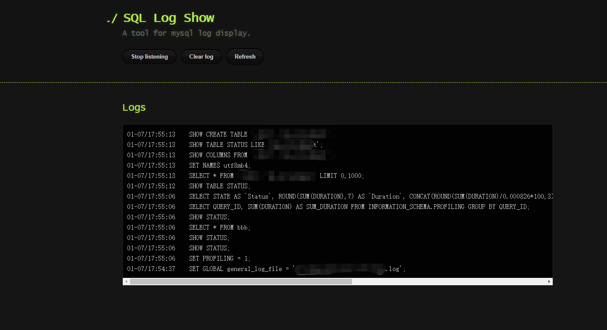

## 一个MySQL，sql语句监听的工具。

## 快速开始
如果你安装了php环境，而且将php执行文件加入了你的环境变量。  
你只需要一行命令
```
php -S localhost:8080
```
或者
```
[php执行文件的路径]/php php -S localhost:8080
```





> English Doc

## A tool for mysql log display.

## Quick start

If you installed php and added php to the environment variables. You only need one line of code.

```
php -S localhost:8080
```


